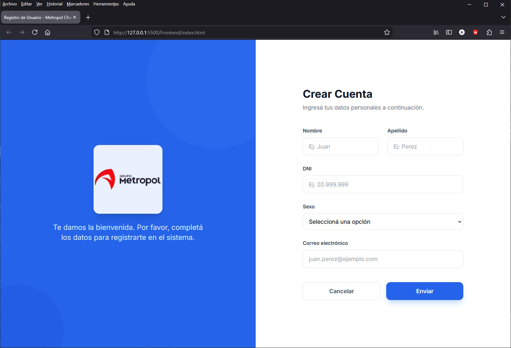
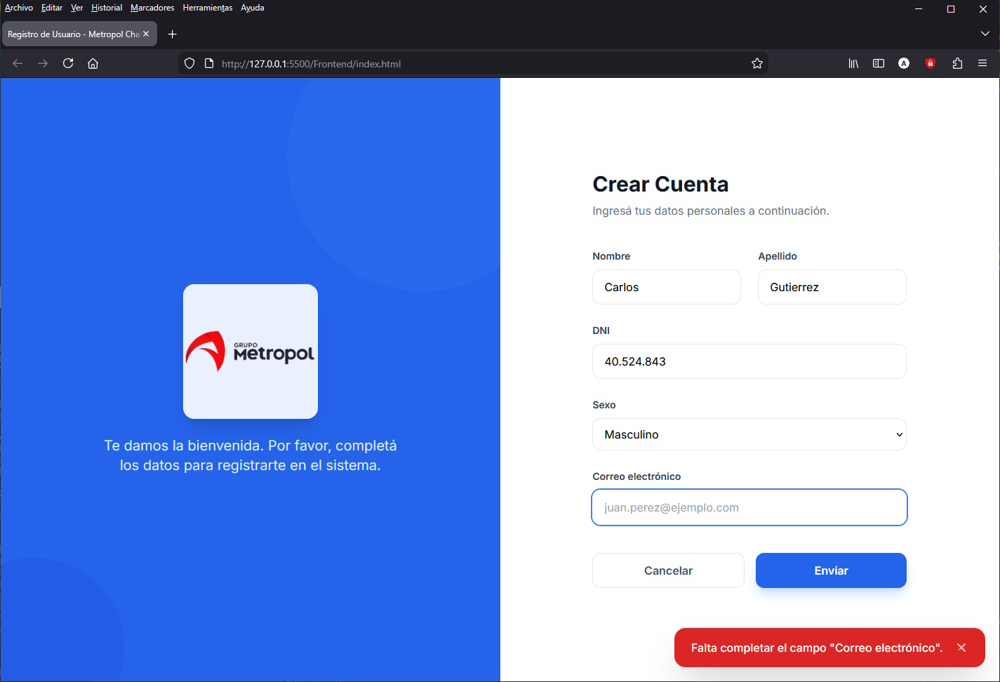
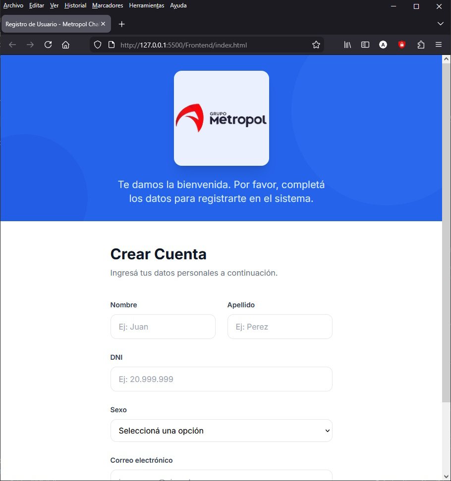
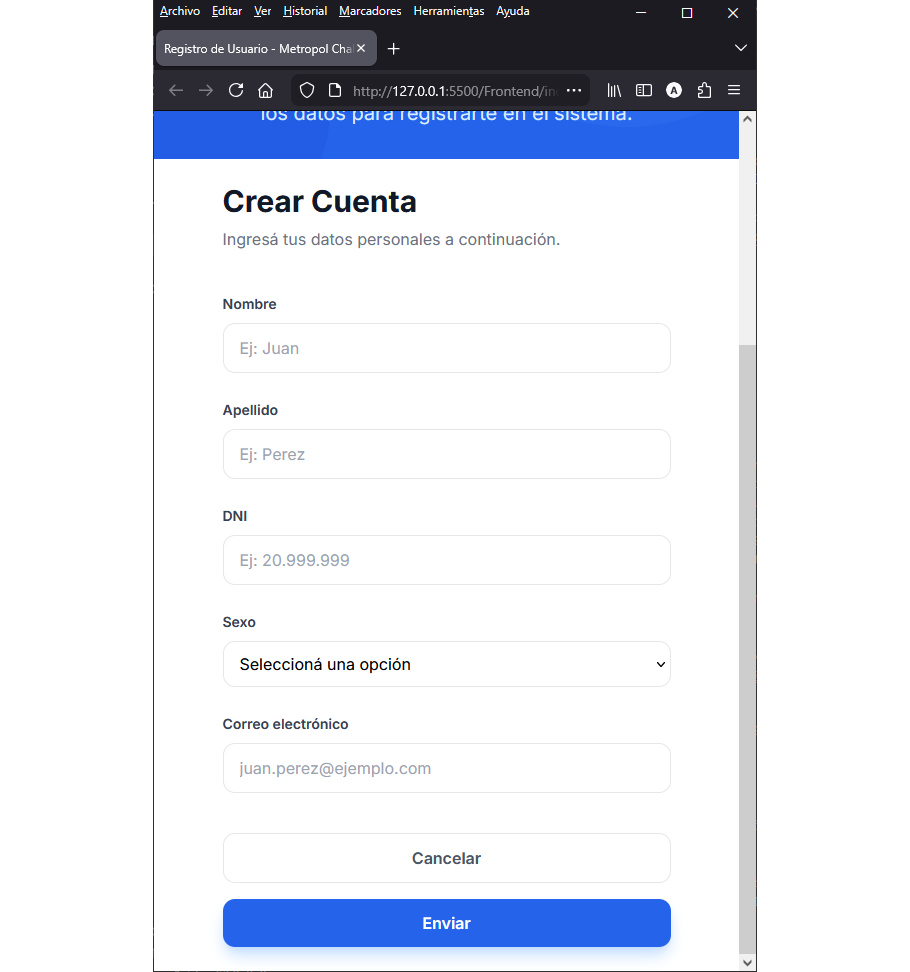
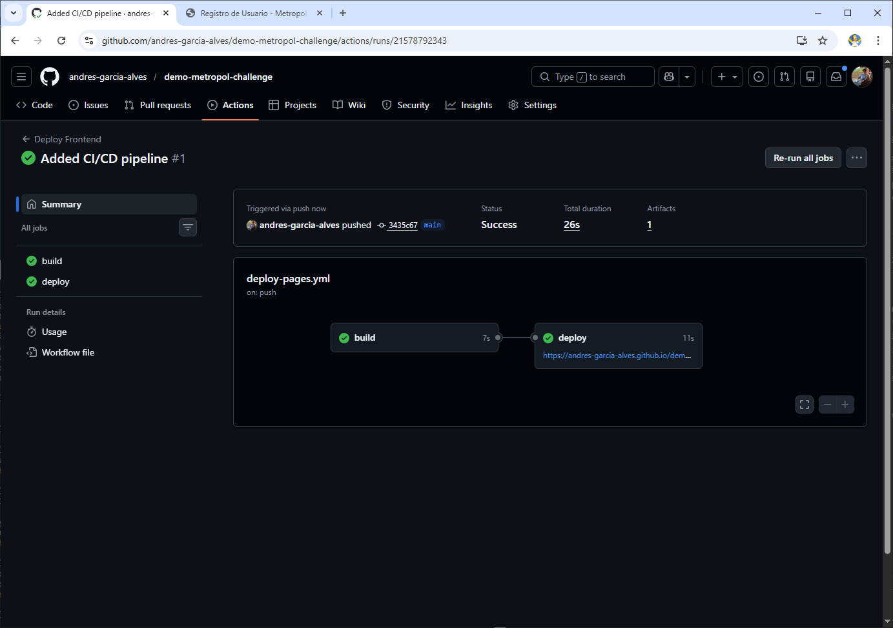

# Metropol Challenge

Proyecto demo para la solicitud de empleo en Metropol.

| Acceso                | URL                                                              |
| --------------------- | ---------------------------------------------------------------- |
| **REPOSITORIO**       | https://github.com/andres-garcia-alves/demo-metropol-challenge   |
| **LIVE APP**          | https://andres-garcia-alves.github.io/demo-metropol-challenge    |
| **BACKEND API**       | https://metropol-backend.azurewebsites.net/api/v1                |
| - Endpoint Personas   | https://metropol-backend.azurewebsites.net/api/v1/personas       |
| **BACKEND DOCS**      | https://metropol-backend.azurewebsites.net/scalar/v1             |

&nbsp;

## Listado de Features:

#### - FRONTEND

- Uso los íconos y tipografía oficial (open sans) de la marca.

- Diseño `responsive`:
  - 3 breaking-points: **grande**, **medio** (tablets) y **pequeño** (smartphones)
  - Stackeo de los bloques de contenido

- Única salvedad respecto a no usar frameworks:
  - Agregué la librería `Tailwind CSS`, que no es framework/librería de JavaScript sino de CSS.
  - Sin estilos el front se veía espantoso. 😅
  - La utilizo vía CDN, no requiere instalación.
  - ¿Lo puedo hacer con el CSS a mano? Sí, definitivamente, pero para una demo me parece que no valía la pena.
  - Si lo requieren ¡avisen!, cero drama de hacer los estilos con CSS plano.

#### - BACKEND

- Desarrollado en .NET 10 (versión recién salida del horno).
  - Desconozco las herramientas que tenga instaladas quien evalúe la demo.
  - Si prefieren por compatibilidad que utilice alguna versión previa, avisen, que sería un cambio de 5 minutos.

- Detalle de la estructura del backend:
  - `Controllers/`: Endpoints de la API.
  - `DTOs/`: Objetos de transferencia de datos.
  - `BusinessLogic/`: Mapeos y reglas de validación.
  - `Entities/`: Modelos de datos para persistencia.
  - `DataAccess/`: Contexto de base de datos.

- Uso de la librería `FluentValidations` para validación de entidades.

- Uso de `AutoMapper` para mapeos entre DTOs y Entidades.

- Patrón de diseño `Repository` para la capa de acceso a datos.

- Uso de `SQlite` para la DB (por mepa simplicidad, ya que no requiere un server externo).  
  Se puede utilizar el popular `DB Browser for SQLite` (entre otros) para acceder a la DB.

- Test Unitarios implementados en `MSTest`, la librería oficial de MS.

- Logs implementados con `Serilog`, por simplicidad, al archivo `Logs/logs.txt`.

- **Docs online** con `Scalar`
  - Nuevo en .NET 10 (muy similar al `Swagger` de toda la vida)
  - URL de acceso: https://localhost:5000/scalar/v1

- Mecanismo de `autenticación`+`autorización`:
  - Parto de la base que es un formulario de registración (acceso público) y no lleva auth.
  - Si lo requieren (fuera del alcance de la consigna original) implemento uno facilito, vía `JWT` (JSON Web Tokens).  
    Algo del estilo:
    - Form. de Registración (el actual), de acceso público.
    - Form. de Login, de acceso público.
    - Landing-Page / Panel-de-Control (o algo similar), con mecanismo de autenticación`+`autorización, de acceso **privado**.

- Mecanismo de control de cambios... `GitFlow`
  - Uso de ramas `main` y `develop`.
  - Dado el alcance limitado de la demo, omití los branches independientes por feature individual.

#### - PROYECTO

- Implemento **CI/CD** vía `GitHub Actions`.
- Frontend alojado en `GitHub Pages`.
- Backend alojado en `Azure App Service`

#### - NOTAS

- Hay cosas que obviamente se pueden mejorar, pero ya sobrepasarían el alcance de una demo y de la consigna inicial:
  - Uso de Caché (según el endpoint en cuestión) para mejorar performance y reducir consumo de recursos.
  - Los controllers que hereden de un ControllerBase, centalizando logs y manejo de errores.
  - Usar una DB en servidor aparte, en lugar de una DB embebida.
  - PK, índices y constraints en las tablas de la DB.
  - etc.

- Aprovecho el repo de la demo, y los invito a visitar mi GitHub: son 40+ repos con aplicaciones web, desktop, IA, electrónica, videojuegos, etc... y según cada temática utilizando algunas de sus herramientas y tecnologías más relevantes: .NET, frameworks para JavaScript/TypeScript, Python, C/C++, y un largo etc.

- Si se me estuviera escapando algo y lo requieren, avisen, ningún drama en agregarlo/implementarlo.

&nbsp;

## Requisitos

- SDK .NET 10
- Para ejecutar el **backend** en local (paso a paso):

  #1. Navegar a la carpeta con el backend del proyecto
  <pre>cd "./Backend/Backend"</pre>

  #2. Restaurar dependencias, compilar y ejecutar
  <pre>dotnet restore  
  dotnet run</pre>

- Para ejecutar el **frontend**en local (paso a paso):

  - Opción A. Instalar la extensión `Live Server` de VSCode (mayor comodidad).
  - Opción B. Navegar a la carpeta del proyecto frontend y doble click en el archivo `index.html` (mayor simpleza).

- Para ejecutar los test unitarios:

  <pre>dotnet test "./Backend/UnitTests/UnitTests.csproj"</pre>

&nbsp;

## Screenshots

| Form. de Registro                        | Validaciones                             |
|------------------------------------------|------------------------------------------|
|          |          |

| Responsive: Tablets                      | Responsive: Mobile                       |
|------------------------------------------|------------------------------------------|
|          |          |

| CI/CD                                    | Backend API                              |
|------------------------------------------|------------------------------------------|
|          |          |

&nbsp;

## Version History

v1.0 (2026.02.01) - First commit.  
v1.1 (2026.02.02) - Added validations and responsive design.  
v1.2 (2026.02.02) - Added CI/CD pipeline.  
v1.3 (2026.02.04) - Added Backend base code.  
v1.4 (2026.02.05) - Minor source code improvements.  
v1.5 (2026.02.05) - Added Azure deployment.  
v1.6 (2026.02.06) - Update 'README.md'.  

&nbsp;

This source code is licensed under GPL v3.0  
Please send me your feedback about this project: andres.garcia.alves@gmail.com
